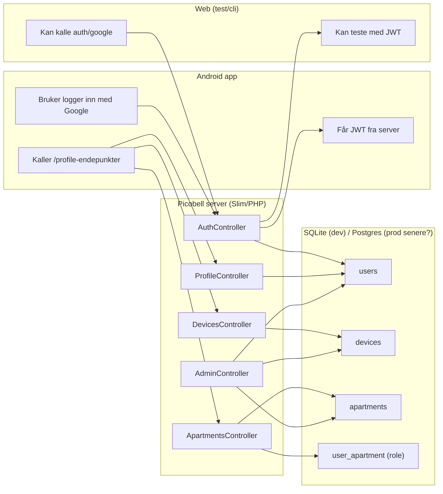
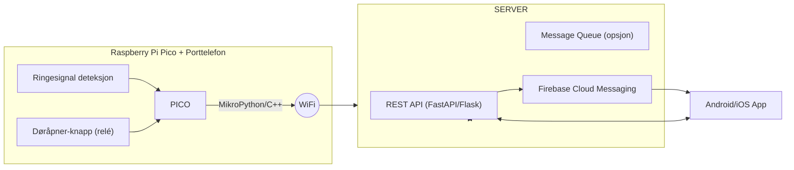
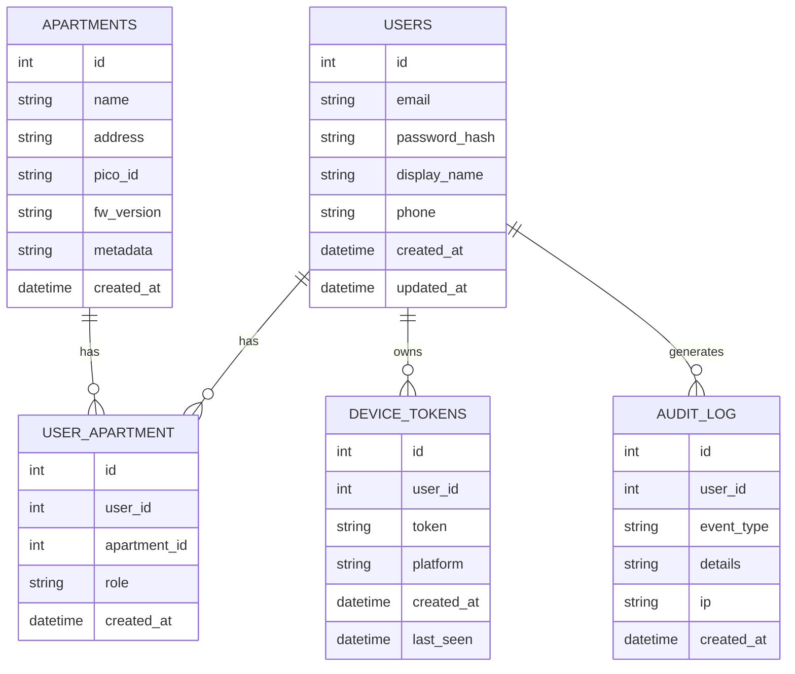
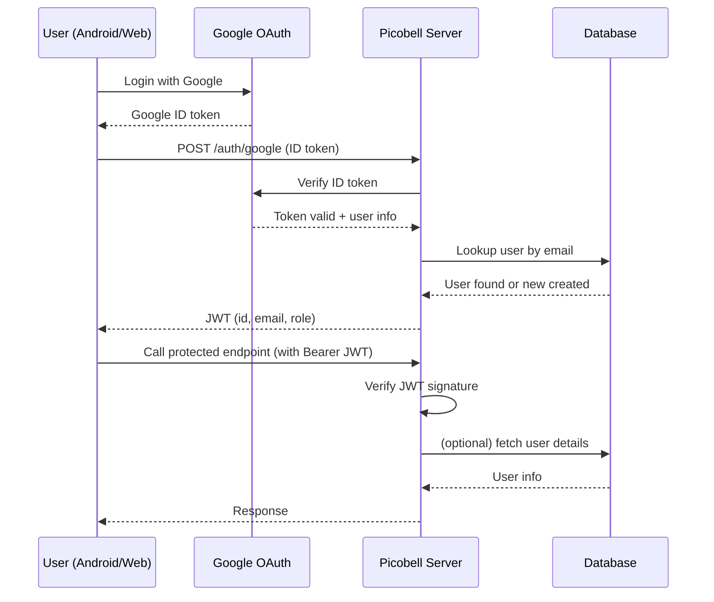

# PicoBell Doorbell Project

Prosjekt for å gjøre eksisterende porttelefon smartere.   Målet er å kunne motta ringesignaler på mobil, og åpne døren fra en egen app – uten å miste dagens funksjonalitet.

Se [docs](docs/) for detaljert dokumentasjon.

## Struktur

    doorbell-project/
    │
    ├── pico/                # Alt for Pico-mikrokontrolleren
    │   ├── firmware/        # C++/Micropython/Pico SDK kode
    │   └── docs/            # Notater om HW-tilkobling, skjema osv.
    │
    ├── server/           # PHP-backend (API)
    │   ├── public/       # Web-root (index.php)
    │   ├── src/          # PHP-kode (controllers, services)
    │   ├── config/       # Konfig (dotenv, secrets, firebase.json)
    │   ├── vendor/       # Composer dependencies
    │   ├── composer.json # Composer config
    │   └── composer.lock
    │
    ├── mobile/              # Klient-app
    │   ├── android/         # Android-kode
    │   ├── ios/             # (ev. senere)
    │   └── shared/          # Felles ressurser (ikon, assets, logoer)
    │
    ├── docs/                # Arkitekturdiagrammer, flyt, API-spec
    │
    └── .gitignore

## Systemoversikt

## Arkitektur (oversikt)

## Komponenter

* Pico: Leser ringesignalet, styrer døråpner.
* Server: Python (FastAPI/Flask). Håndterer API, push-varsler, autentisering.
* Mobilapp: Android (og evt. iOS). Mottar varsler, gir bruker mulighet til å åpne dør.

## Database

Det er behov for en database for følgende oppgaver:

* Registrering av brukere
* Registrering av leiligheter/picoer

## Sikkerhet

* Pico fungerer kun som klient, aldri åpen port mot internett.
* Server kjører med TLS (nginx som reverse proxy).
* Push-varsler håndteres via Firebase (Android) og evt. APNs (iOS).
* API autentisering med tokens (JWT eller lignende).

## Authentisering

