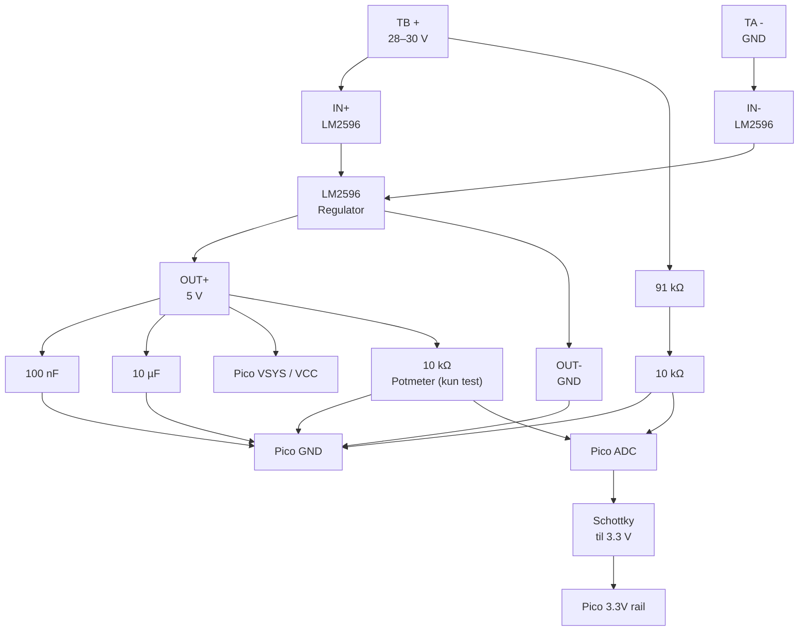
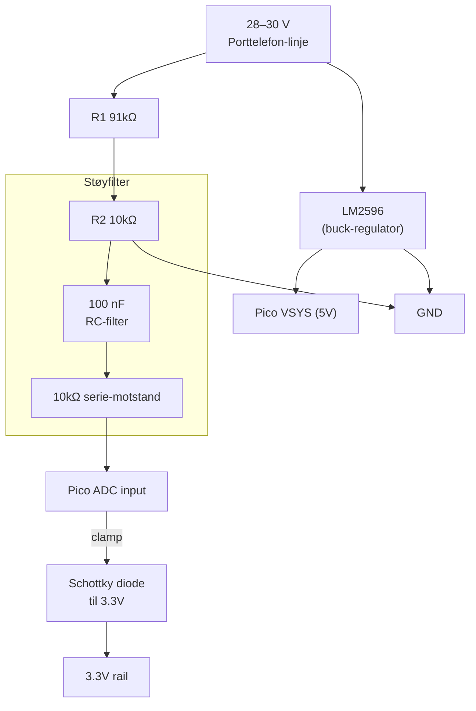

Koblingsskjema for dørtelefon / Pico
====================================

Enkel oversikt over hvordan piko kan kobles opp

## Strømforsyning og signal-tap

```mermaid
flowchart TD

    %% Raw supply
    TBP["TB +<br>28–30 V"] --> INP["IN+<br>LM2596"]
    TBN["TA -<br>GND"] --> INN["IN-<br>LM2596"]

    %% Regulator
    INP --> REG["LM2596<br>Regulator"]
    INN --> REG

    %% Regulated output
    REG --> OUTP["OUT+<br>5 V"]
    REG --> OUTN["OUT-<br>GND"]

    %% Pico power
    OUTP --> C1["100 nF"]
    OUTP --> C2["10 µF"]
    C1 --> PGND["Pico GND"]
    C2 --> PGND
    OUTP --> VCC["Pico VSYS / VCC"]
    OUTN --> PGND

    %% Signal tap (BEFORE regulator)
    TBP --> R1["91 kΩ"]
    R1 --> R2["10 kΩ"]
    R2 --> PGND

    R2 --> ADC["Pico ADC"]

    %% Protection
    ADC --> D1["Schottky<br>til 3.3 V"]
    D1 --> PICO33["Pico 3.3V rail"]

    %% Test potentiometer
    OUTP --> POT["10 kΩ<br>Potmeter (kun test)"]
    POT --> PGND
    POT --> ADC

```

## Fokus på signal-tap for dørtelefon

```mermaid

flowchart TD

    PORT["28–30 V<br>Porttelefon-linje"]

    %% Power path
    PORT --> BREG["LM2596<br>(buck-regulator)"]
    BREG --> VSYS["Pico VSYS (5V)"]

    %% Signal tap
    PORT --> R1["R1 91kΩ"]
    R1 --> R2["R2 10kΩ"]
    subgraph FILTER ["Støyfilter"]
        R2 --> FILT["100 nF<br>RC-filter"]
        FILT --> SER["10kΩ serie-motstand"]
    end
    SER --> ADC["Pico ADC input"]

    %% Protection
    ADC -->|clamp| DIO["Schottky diode<br>til 3.3V"]
    DIO --> V33["3.3V rail"]

    R2 --> GND
    BREG --> GND
```
