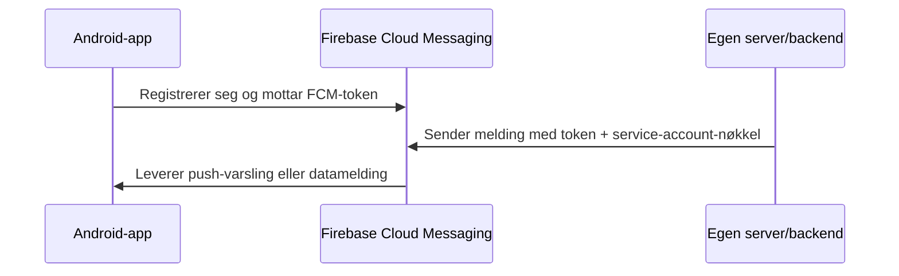
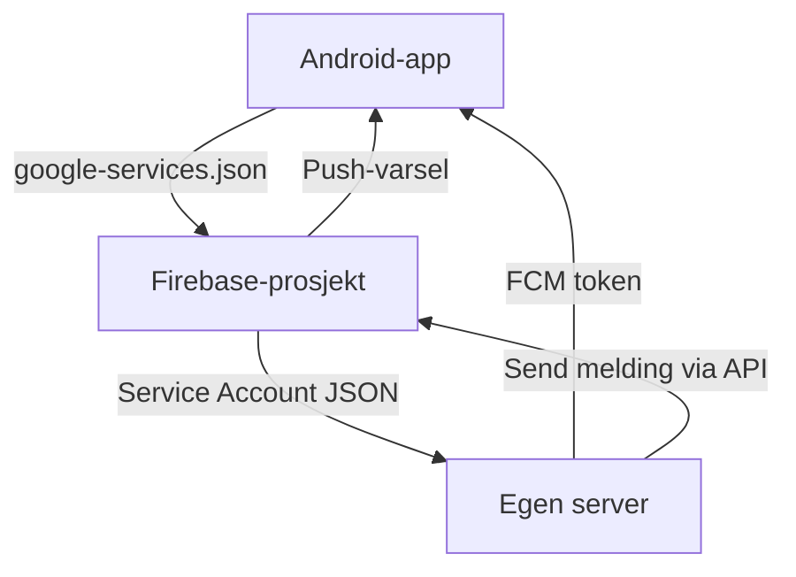

# Google Firebase Cloud Messaging (FCM) – Oversikt

Firebase Cloud Messaging (FCM) er en gratis tjeneste fra Google som gjør det
mulig å sende **push-varsler** og **meldinger** til Android-, iOS- og
webapplikasjoner.

## Hva det brukes til

- Sende **varsler** til brukeren selv når appen er lukket.  
- Sende **datameldinger** til appen for å oppdatere innhold i bakgrunnen.  
- Brukes ofte sammen med backend-tjenester for sanntidsoppdateringer.

---

## Arkitektur og flyt



---

## 1. Oppsett av Firebase-prosjekt

1. Gå til [Firebase Console](https://console.firebase.google.com).  
2. Opprett et prosjekt.  
3. Aktiver **Cloud Messaging** i prosjektet.  
4. Knytt Android-appen din til prosjektet ved å legge inn appens
   `package name`.

---

## 2. Android-klientoppsett

### a. Legg til Firebase i prosjektet

1. I `build.gradle` (app-nivå), sørg for at du har:

   ```gradle
   implementation 'com.google.firebase:firebase-messaging:23.+'
   ```

2. Legg til `google-services` plugin i `build.gradle` (root og app-nivå).

### b. Konfigurasjonsfil

Firebase genererer en fil kalt **`google-services.json`** som inneholder:

- Firebase-prosjekt-ID  
- App-ID  
- API-nøkler  
- Konfigurasjon for meldinger og analytics

Denne skal legges i:
````
app/google-services.json
````

### c. Håndtering av meldinger

I appen må du implementere en `FirebaseMessagingService`, for eksempel:

```kotlin
class MyFirebaseService : FirebaseMessagingService() {
    override fun onMessageReceived(msg: RemoteMessage) {
        Log.d("FCM", "Melding mottatt: ${msg.data}")
    }

    override fun onNewToken(token: String) {
        Log.d("FCM", "Ny token: $token")
        // Send token til server
    }
}
```

---

## 3. Serveroppsett

Serveren trenger autentisering mot FCM ved hjelp av en
**Service Account-nøkkel**.

### a. Last ned nøkkelfil

1. I Firebase Console → **Project Settings → Service accounts**  
2. Klikk “Generate new private key”  
3. Last ned `service-account.json`

Filnavnet kan være noe som:
````
service-account-firebase-adminsdk-xxxx.json
````

### b. Autentisering (OAuth 2.0)

Service Account-nøkkelen brukes av serveren til å opprette et OAuth2-token
automatisk når den sender meldinger via FCM REST API eller Firebase Admin SDK.

Eksempel i Python med Firebase Admin SDK:

```python
import firebase_admin
from firebase_admin import credentials, messaging

cred = credentials.Certificate("service-account.json")
firebase_admin.initialize_app(cred)

def send_push(fcm_token, title, body):
    message = messaging.Message(
        notification=messaging.Notification(title=title, body=body),
        token=fcm_token
    )
    response = messaging.send(message)
    print("Sendt:", response)
```

---

## 4. FCM-token

- Hver app-installasjon får et unikt **FCM-token**.  
- Dette tokenet brukes av serveren til å identifisere mottakeren.  
- Tokenet må lagres (typisk i din backend) når appen registrerer seg.

---

## 5. Sammenheng mellom komponentene



---

## Oppsummert

| Komponent | Fil / Oppsett | Formål |
|------------|----------------|--------|
| Android-app | `google-services.json` | Firebase-konfigurasjon for klient |
| Server | `service-account.json` | Autentisering mot FCM |
| App-token | FCM-token | Identifiserer enhet for meldinger |
| Firebase Console | Prosjekt + Cloud Messaging | Administrasjon og nøkkelutstedelse |

---

**Kort sagt:**  
- Android-klienten får et FCM-token og sender det til serveren.  
- Serveren bruker service-account.json for å autentisere seg mot Firebase.  
- Serveren sender meldinger via FCM API til spesifikke tokens.  
- Firebase leverer varsel til appen.
EOF
