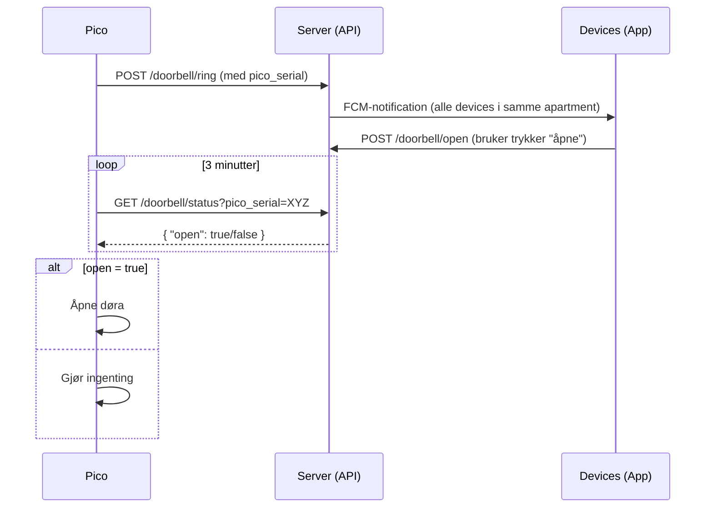

Kommunikasjon mellom Pico og Android/iOS App
============================================

Diagrammet nedenfor beskriver kommunikasjonen mellom Pico, serveren (API) og 
enhetene (appene) ved bruk av Firebase Cloud Messaging (FCM).

