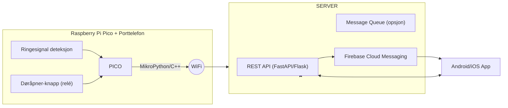

# Dokumentasjon – Doorbell Project

Her beskrives arkitektur, kommunikasjon og oppsett mer detaljert.

---

## Arkitektur

## Dataflyt

1. Noen ringer på døren
    Pico detekterer signal → sender HTTP request til server.
2. Server mottar signal
    Backend registrerer hendelsen → sender push-varsel via FCM/APNs.
3. Mobilapp mottar varsel
    Bruker får notifikasjon → kan åpne appen og velge "Åpne dør".
4. Åpne dør
    App kaller API på server → server sender kommando til Pico → Pico trigger "åpne dør"-relé.

## Komponenter

* Pico: Leser ringesignalet, styrer døråpner.
* Server: Python (FastAPI/Flask). Håndterer API, push-varsler, autentisering.
* Mobilapp: Android (og evt. iOS). Mottar varsler, gir bruker mulighet til å åpne dør.

## Sikkerhet

* Pico fungerer kun som klient, aldri åpen port mot internett.
* Server kjører med TLS (nginx som reverse proxy).
* Push-varsler håndteres via Firebase (Android) og evt. APNs (iOS).
* API autentisering med tokens (JWT eller lignende).

## Videre arbeid

* [ ]  Implementere Pico-firmware for å sende events.
* [ ]  Lage Python-server med REST-endepunkter.
* [ ]  Integrere push-varsler.
* [ ]  Utvikle Android-app (MVP).
* [ ]  Teste helheten.