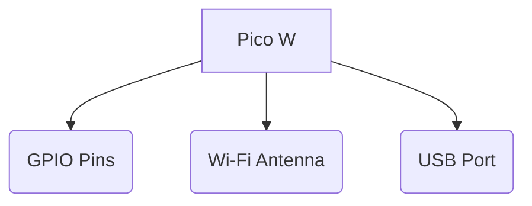
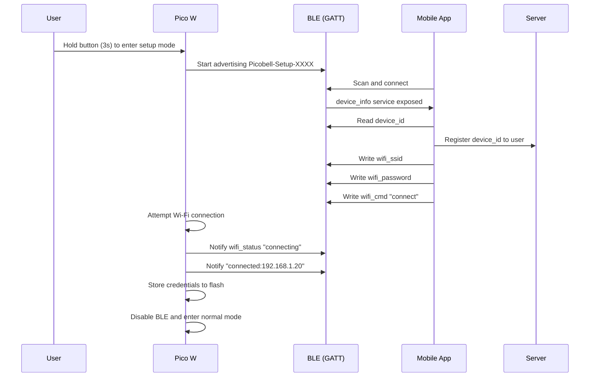

# Picobell Pico Firmware

Firmware for Raspberry Pi Pico W som håndterer:

* BLE provisioning (Wi-Fi konfigurering via mobil)
* Unik enhets-identifikasjon (MAC-adresse)
* Sikker lagring av Wi-Fi-credentials
* Normal drift når Wi-Fi er konfigurert
* Boot-logikk for å starte provisioning på knapp

Dette er en del av Picobell-systemet hvor mobilapp, server og Pico-
enheter samarbeider om å administrere dørklokke- og adgangsfunksjoner.

---

## Pico W Pinout

In mermaid:

---

## BLE Provisioning Flow

## 📁 Filstruktur

pico/
├── README.md
├── src/
│   ├── main.py
│   ├── ble_provision.py
│   ├── wifi_manager.py
│   ├── device_info.py
│   ├── buttons.py
│   ├── led.py
│   ├── storage.py
├── flash/
│   ├── wifi.json
│   └── secrets.json (optional)
├── tools/
│   ├── mpremote.sh
│   ├── build-fw.sh
└── tests/
    ├── test_ble.md
    ├── test_wifi.md

## 🧠 Komponenter

### main.py
Bestemmer modus basert på:om lagrede credentials finnes om brukeren holder inne knappen

### ble_provision.py

Eksponerer GATT-services:device_info
wifi_prov Tar imot SSID/passord og kommandoer fra app.

### wifi_manager.py

Kobler til Wi-Fi, henter status og returnerer resultat til BLE.

### storage.py

Lagrer credentials trygt i flash som JSON.

### device_info.py

Gir unik enhets-ID (MAC) og firmware-versjon.

### buttons.py

Oppdager knapp for å trigge provisioning.

### led.py

Viser status:langsomt blink = provisioningrask blink = connectingfast lys = connectedpulserende = error🧪 Testing uten appDu kan test-provisione hele enheten med nRF Connect:Scan → Picobell-Setup-XXXXKoble tilLes device_idSkriv wifi_ssidSkriv wifi_passwordSkriv wifi_cmd = "connect"Observer wifi_status notifications📦 DeployBruk

### tools/mpremote.sh:

### tools/mpremote.sh put src/*.py :🧭

## Videre arbeid

OTA-oppdateringer (opsjon)
Hardening av BLE (pairing + nonce)
Logging av hendelser til serverEOF
