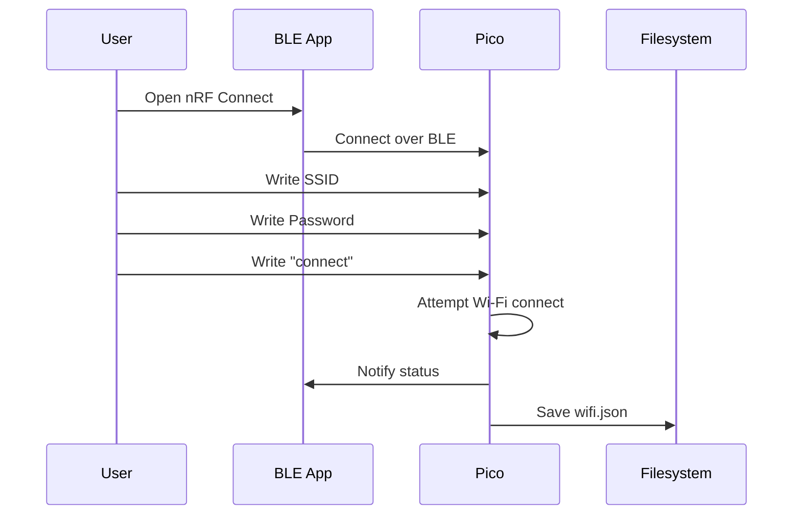

# Testing BLE Provisioning on the Pico W

## Overview

Picobell Pico W exposes a Bluetooth Low Energy (BLE) service that lets you set
Wi-Fi credentials from any BLE scanner app (e.g. nRF Connect). This guide shows
how to verify provisioning works without the Picobell mobile app.

---

## What You Need

* A Raspberry Pi Pico W flashed with MicroPython
* The file `ble_provision.py` uploaded to the device
* A BLE scanner app such as **nRF Connect** (Android/iOS)

---

## How to Test

### 1. Boot Pico in provisioning mode

* Ensure there is **no `/flash/wifi.json`** on the Pico
  (delete it from Thonny if needed)
* Or: hold the provisioning button if your project supports it

The Pico will begin advertising over BLE.

---

### 2. Open nRF Connect

* Open **Scanner**
* Look for a device named:
  `Picobell-XXXX`
  (`XXXX` is the last 4 hex of the MAC)

If the name shows as *N/A*, ensure `gap_name` is set in your code.

---

### 3. Connect to the device

Tap the device, then tap **Connect**.

You should now see the provisioning service with characteristics.

---

### 4. Write SSID

Find the `UUID_SSID` characteristic and write a UTF-8 string, e.g.
my-wifi

---

### 5. Write password

Find `UUID_PASS` and write the password.

---

### 6. Start connection

Write the string:
connect
…to the `UUID_CMD` characteristic.

---

### 7. Watch status

Observe notifications from `UUID_STATUS`:

* `connecting`
* `connected:<ip>`
* `failed`

---

### 8. Verify credentials saved

Open Pico’s file system in Thonny:
/flash/wifi.json
The file should contain:
{ "ssid": "...", "pwd": "..." }

---

## Mermaid: BLE Provisioning Flow

