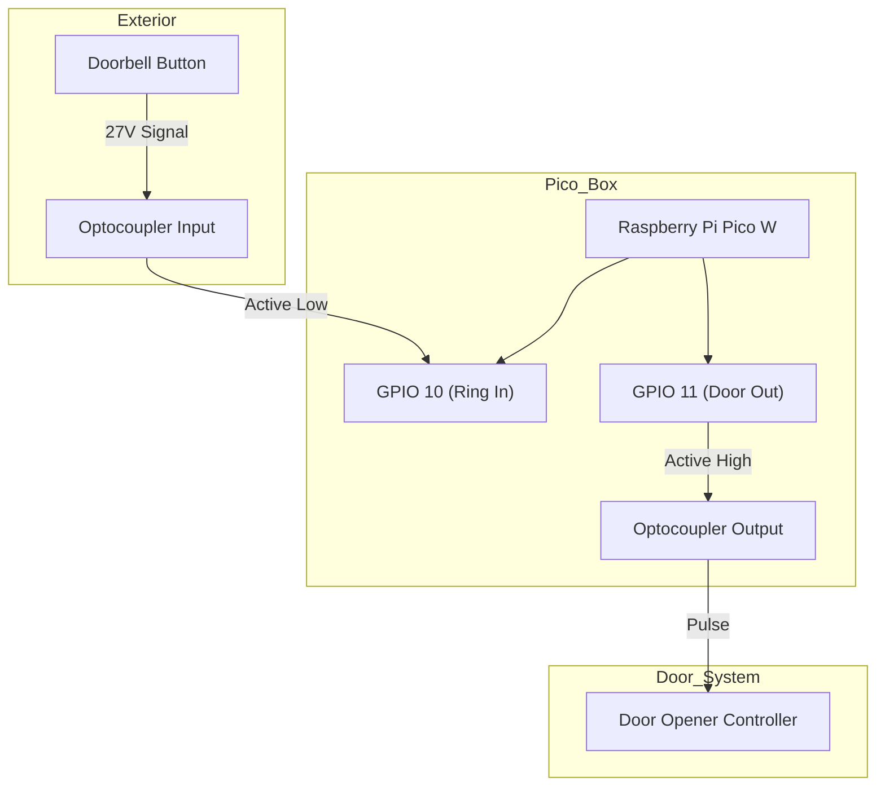
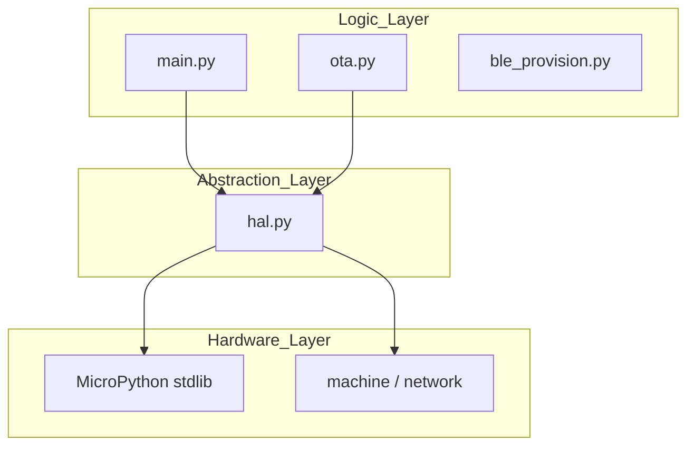

# Architecture & Components

## TL;DR
* **Main Loop**: `main.py` handles the state machine.
* **HAL**: `hal.py` abstracts hardware for testing.
* **Pins**: GPIO 10 (Ring In), GPIO 11 (Door Out).
* **OTA**: Auto-updates from `picobell.no` on boot.

---

## Hardware Connection

| Component | Pico Pin | Type | Logic |
| :--- | :--- | :--- | :--- |
| **Ring Input** | GPIO 10 | Input (Pull-Up) | Optocoupler (Active Low) |
| **Door Output** | GPIO 11 | Output | Optocoupler (Active High/Pulse) |
| **Boot Button** | GPIO 15 | Input | Hold 3s to Reset/BLE Mode |
| **LED** | LED | Output | Status Indicator |

## Software Modules

### `src/main.py`
The entry point. Initialises `DoorbellApp`, connects to Wi-Fi, and runs the main loop.
* **Boot**: Load `wifi.json`. If missing -> BLE Mode.
* **Loop**: Check Ring Pin -> Send HTTP Request -> Poll for "Open" command.

### `src/hal.py` (Hardware Abstraction Layer)
Wraps all interaction with `machine`, `network`, and `urequests`.
* **Reason**: Allows running the exact same logic code on a PC for testing (mocking hardware) and on the Pico (real hardware).

### `src/ota.py`
Handles Over-The-Air firmware updates.
* Checks `https://picobell.no/firmware/version.json`.
* Downloads and overwrites `.py` files if version differs.

### `src/ble_provision.py`
Standard BLE GATT server for receiving Wi-Fi credentials.
