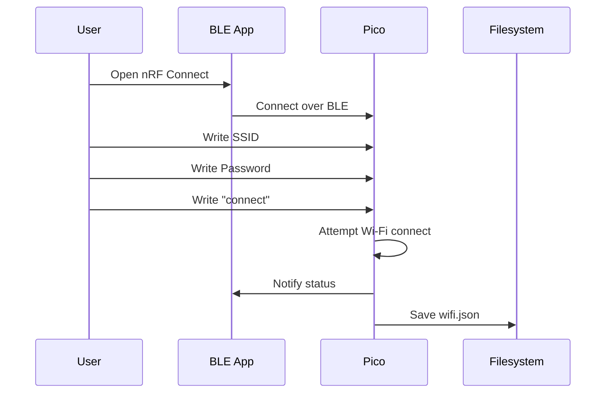

# BLE Provisioning

## TL;DR
* **Purpose**: Set Wi-Fi credentials via Bluetooth.
* **App**: Use **nRF Connect** (Android/iOS).
* **Device Name**: `Picobell-XXXX`
* **Flow**: Connect -> Write SSID -> Write Password -> Write "connect".

---

## Protocol Details

### Services
The device exposes a custom provisioning service.

### Characteristics

| Characteristic | UUID | Action | Description |
| :--- | :--- | :--- | :--- |
| **SSID** | `UUID_SSID` (Check src) | Write | Wi-Fi SSID (UTF-8) |
| **Password** | `UUID_PASS` (Check src) | Write | Wi-Fi Password |
| **Command** | `UUID_CMD` | Write | Send commands (e.g., `connect`) |
| **Status** | `UUID_STATUS` | Notify | `connecting`, `connected:<ip>`, `failed` |

## Testing Flow (nRF Connect)
1. **Boot** Pico (hold button 3s if already configured, or boot fresh).
2. **Scan** for `Picobell-XXXX`.
3. **Connect** and find the Provisioning Service.
4. **Write** your SSID to `UUID_SSID`.
5. **Write** your Password to `UUID_PASS`.
6. **Write** "connect" to `UUID_CMD`.
7. **Observe** updates on `UUID_STATUS`.

If successful, the Pico saves credentials to `/flash/wifi.json` and reboots.

## BLE Provisioning Flow

