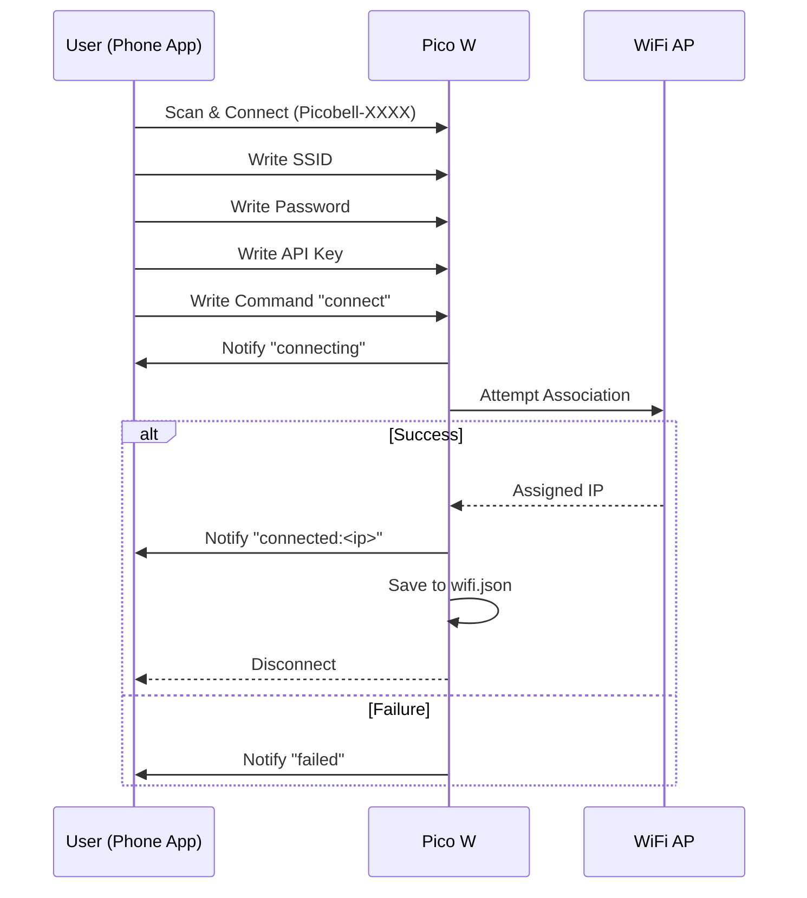
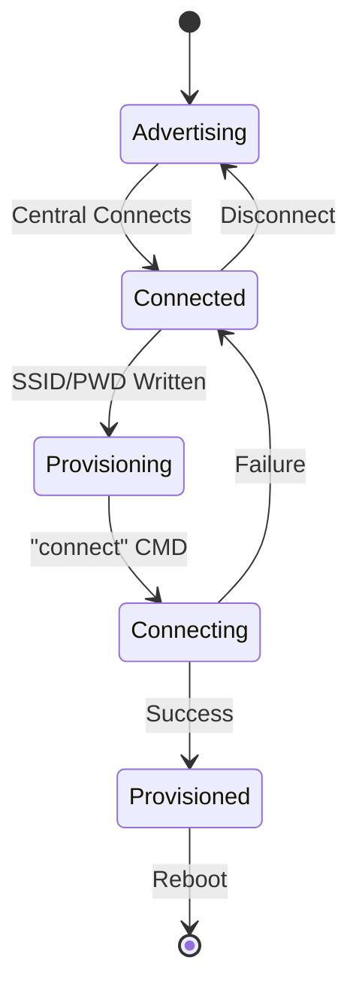

# BLE Provisioning

## Overview
Picobell-Pico-W nodes use BLE (Bluetooth Low Energy) for initial setup. This
allows users to provision Wi-Fi credentials and API keys without a physical
serial connection. Setup is triggered automatically on first boot or manually via a 10-second button hold.

---

## Provisioning Protocol

### Device Identification
- **Name**: `Picobell-XXXX` (where XXXX is the last 4 characters of the MAC
    address).
- **Service UUID**: `12345678-1234-1234-1234-1234567890b0` (Wi-Fi
    Provisioning Service)

### Characteristic Map

| Characteristic | UUID Descriptor | Action | Purpose |
| :--- | :--- | :--- | :--- |
| **SSID** | `...90b1` | Write | Wi-Fi SSID |
| **Password** | `...90b2` | Write | Wi-Fi Password |
| **API Key** | `...90b5` | Write | Device API Key for server authentication |
| **Command** | `...90b3` | Write | Trigger actions (e.g., `connect`) |
| **Status** | `...90b4` | Notify | Real-time feedback (`connecting`, `connected:<ip>`, `failed`) |

---

---

## Entering Provisioning Mode

The device enters BLE Provisioning mode in the following scenarios:

1.  **First Boot**: If `/flash/wifi.json` is missing or contains no SSID.
2.  **Connection Failure**: If saved credentials fail to connect on boot.
3.  **Manual Trigger**: Holding the "Open door" button (**GP15**) for **10 seconds** (or connecting GP15 to GND for 10 seconds).

**Timeout**: Provisionsing mode will automatically stop after **10 minutes** if no setup is completed, and the device will resume normal operation (allowing manual door opening).

---

## Provisioning Flow

The following diagram illustrates the interaction between the User (via a BLE App) and the Pico W.

---

## State Diagram

The device firmware manages states during the provisioning process as follows:

## Testing & Verification
For detailed instructions on how to test this flow locally or on hardware, see the
[BLE Testing Walkthrough](BLE_TESTING_WALKTHROUGH.md).
