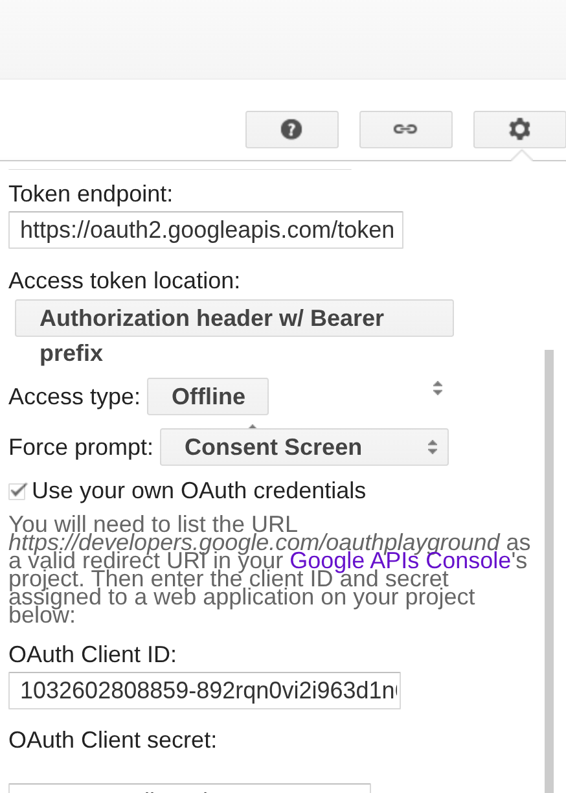

# Slim Framework 4, Medoo og Phinx

Dette prosjektet bruker [Slim Framework 4](https://www.slimframework.com/) som
web-rammeverk, [Medoo](https://medoo.in/) som database-abstraksjonslag, og
[Phinx](https://phinx.org/) for database-migrasjoner.

## Konfigurasjonsfiler (`server/config/`)

Se egen [README.md](config/README.md) for detaljer om konfigurasjon av
applikasjonen.

## Database

Databasen er SQLite for utvikling, og lagres som default i `/tmp/dev.sqlite3`.

## Få test token fra google Google OAuth Playground

* Oauth-appen må auth redirect uri være med, i [console for Google Cloud](https://console.cloud.google.com/):
    - https://developers.google.com/oauthplayground
* Gå til OAuth 2.0 Playground [Oauth playground](https://developers.google.com/oauthplayground)
* Konfigurer for test (se screenshot):
    - Legg inn i tannhjul oppe til høyre
    - Use own OAuth credentials
    - Legg inn client id og secret
* Velg Google OAuth2 API v2 → https://www.googleapis.com/auth/userinfo.email.
* Klikk deg gjennom flowen → du får et ID Token under "Step 2".
* Kopiér det og bruk i Postman når du tester POST /auth/google-login.
