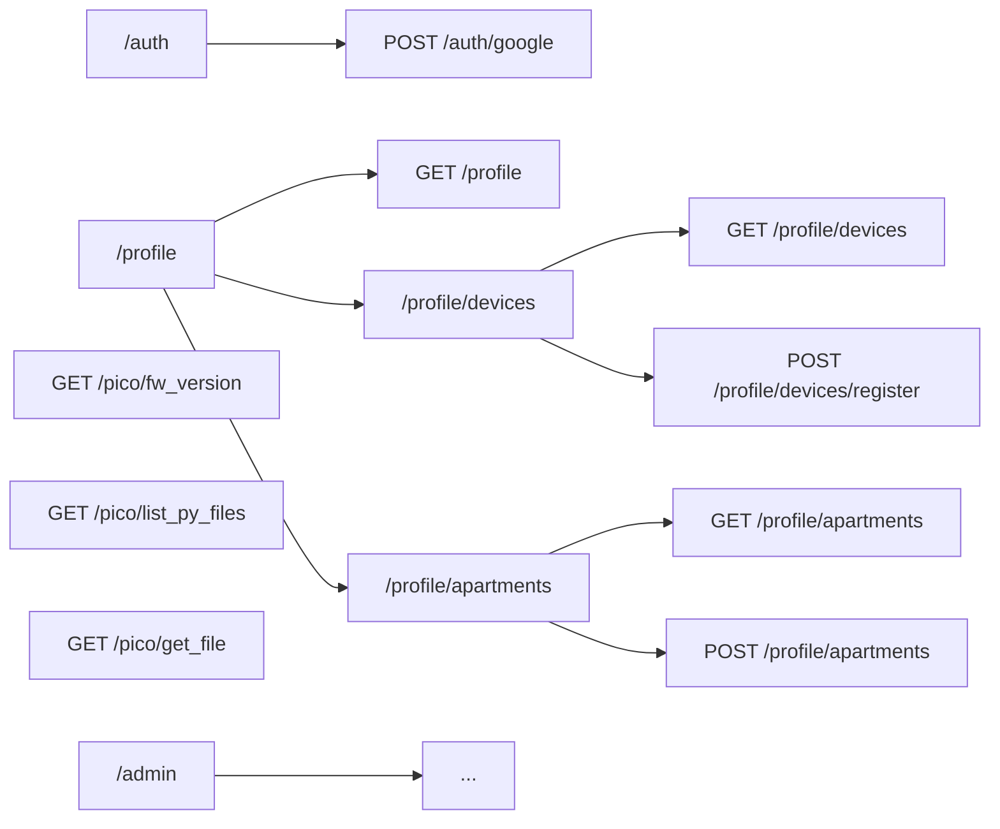

# Slim Framework 4, Medoo og Phinx

Dette prosjektet bruker [Slim Framework 4](https://www.slimframework.com/) som
web-rammeverk, [Medoo](https://medoo.in/) som database-abstraksjonslag, og
[Phinx](https://phinx.org/) for database-migrasjoner.

## Konfigurasjonsfiler (`server/config/`)

Se egen [README.md](config/README.md) for detaljer om konfigurasjon av
applikasjonen.

## Komme i gang (Setup)

### 1. Installer avhengigheter
Sørg for at du har [Composer](https://getcomposer.org/) installert, og kjør:
```bash
composer install
```

### 2. Konfigurer miljøet (.env)
Kopier standard-miljøfilen og sett opp database-detaljer:
```bash
cp config/default.env config/.env
```
Rediger `config/.env` og sett verdiene for `DB_TYPE` (f.eks. `sqlite`) og `DB_DATABASE` (f.eks. `/tmp/picobell.sqlite3`).

### 3. Initialiser databasen
Dette vil kjøre alle migrasjoner og legge inn nødvendige frø-data (seeds). Kommandoen er idempotent og kan kjøres flere ganger:
```bash
composer dbinit
```
Databasen er SQLite for utvikling, og lagres som default i `/tmp/picobell.sqlite3`.

### 4. Start utviklingsserveren
Du kan starte den innebygde PHP-serveren med:
```bash
composer start
```
Serveren vil da være tilgjengelig på `http://localhost:8080`.

## Database

## Få test token fra google Google OAuth Playground


* Oauth-appen må auth redirect uri være med, i [console for Google Cloud](https://console.cloud.google.com/):
    - https://developers.google.com/oauthplayground
* Gå til OAuth 2.0 Playground [Oauth playground](https://developers.google.com/oauthplayground)
* Konfigurer for test (se screenshot):
    - Legg inn i tannhjul oppe til høyre
    - Use own OAuth credentials
    - Legg inn client id og secret
* Velg Google OAuth2 API v2 → https://www.googleapis.com/auth/userinfo.email.
* Klikk deg gjennom flowen → du får et ID Token under "Step 2".
* Kopiér det og bruk i Postman når du tester POST /auth/google-login.

## Oversikt over endepunkter


